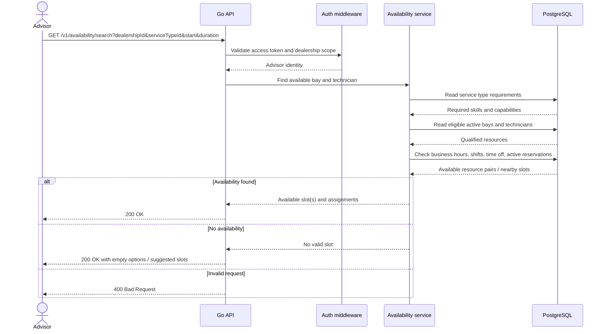
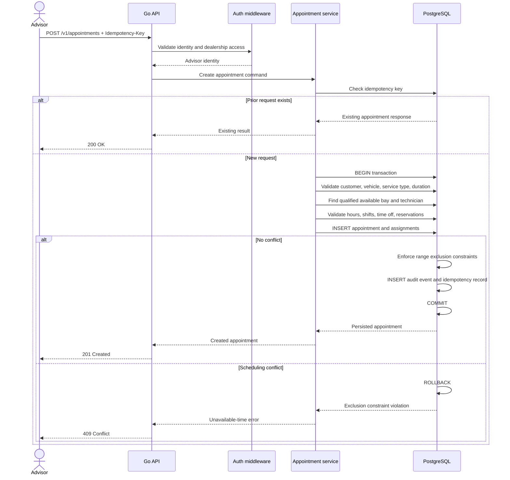
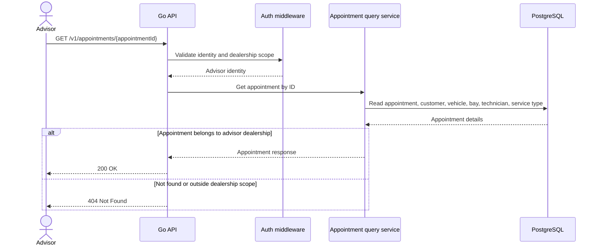
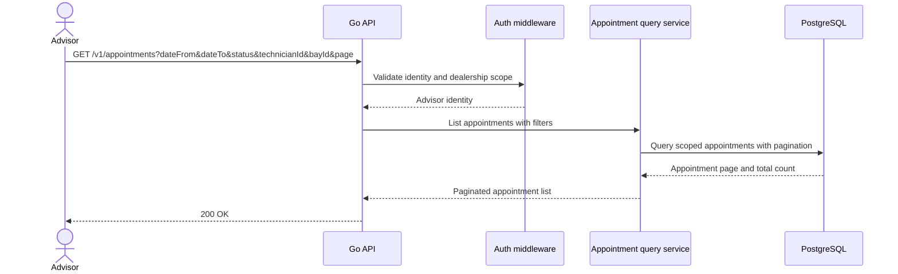
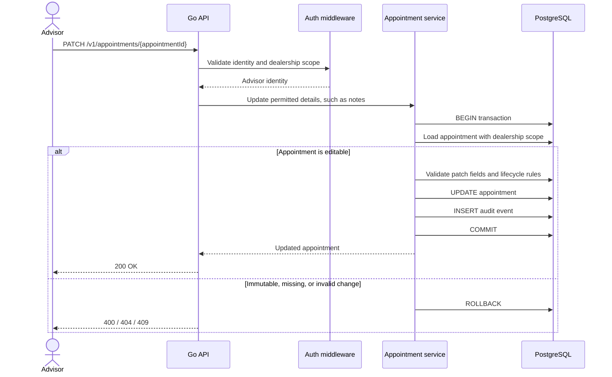
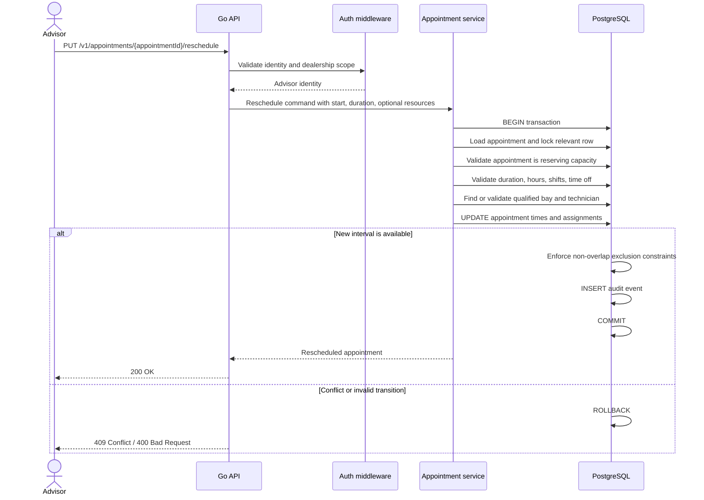
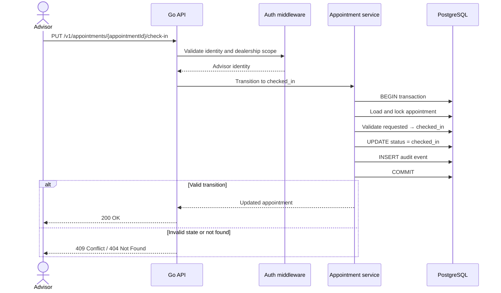
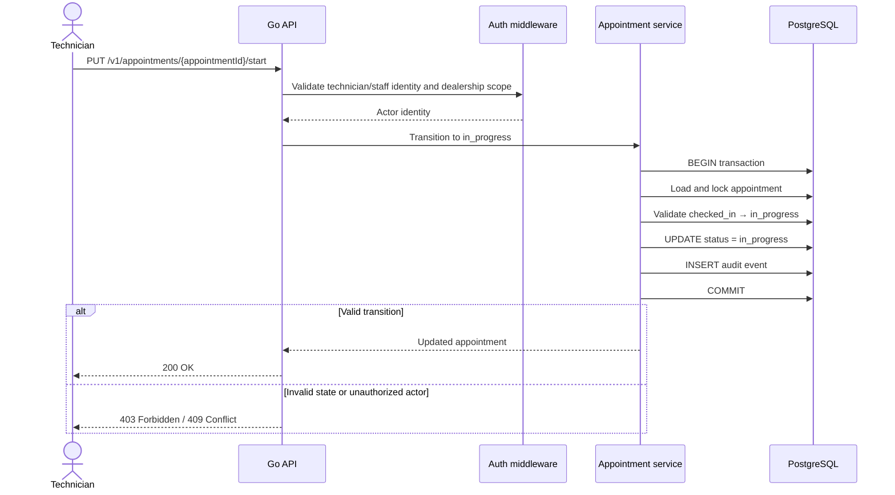
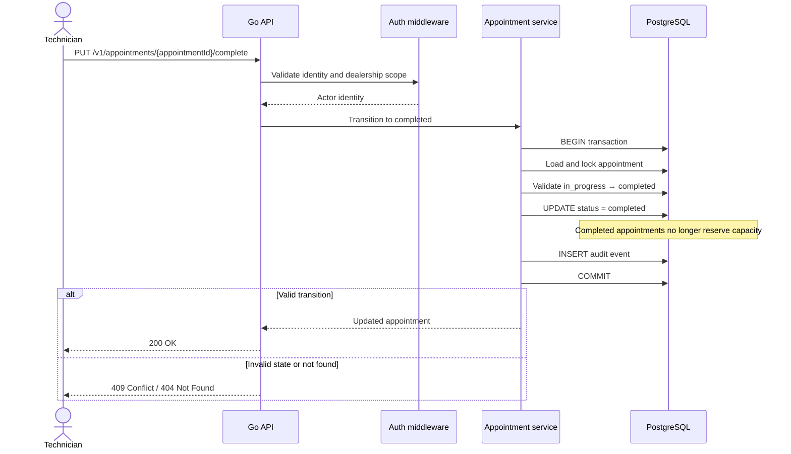
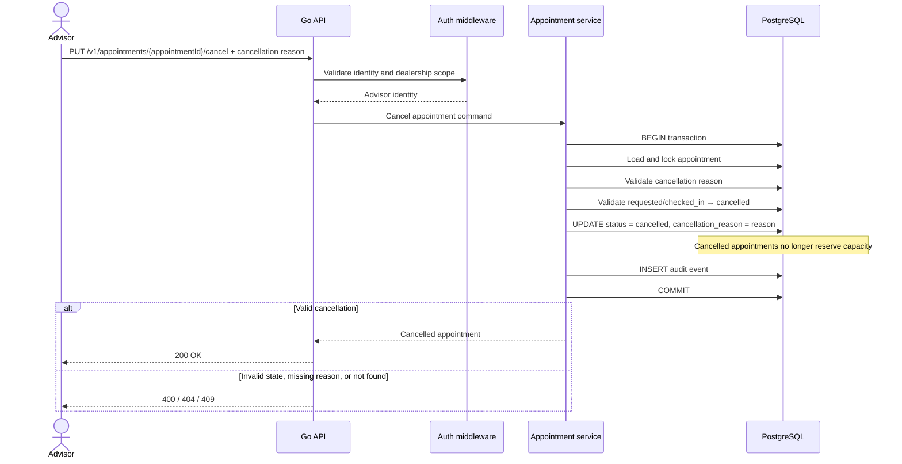

# The Unified Service Scheduler
• Domain: Ownership
• Task: Build an Appointment Scheduler application to replace manual booking systems.
• Core Requirements:
	1. Resource Constrained Booking: Allow a user to request a service appointment for a specific vehicle, service type, and dealership at a desired time.
	2. Real-Time Availability Check: Before confirming, check for the availability of both a ServiceBay and a qualified Technician for the entire service duration.
	3. Confirmed Appointment Record: Upon success, create a persistent Appointment record associating the customer, vehicle, technician, and service bay.

NOTE: I assumed that every preparing service store has it's own service to simplify the system design for this assesssment.

## Design system

### I. Functional Requirements

#### 1. Master data
Manage the scheduling inputs:
- Dealerships: name, code, timezone, business hours.
- Customers: name, phone/email.
- Vehicles: VIN, registration plate, make, model, year, linked customer.
- Service types: name, default duration, permitted duration range, required skills and bay capabilities.
- Service bays: dealership, name/code, active status, capabilities.
- Technicians: dealership, active status, skills/certifications, working shifts and time-off.

#### 2. Create an appointment

The advisor submits:
- Customer and vehicle
- Dealership
- Service type
- Desired start time
- Duration selected/adjusted by the advisor
- Optional notes

The service:
- Validates the dealership, vehicle ownership, service type, duration, and local opening hours.
- Finds an active bay whose capabilities satisfy the service type.
- Finds an active technician at that dealership whose skills satisfy the service type.
- Ensures both are available over the entire interval.
- Atomically creates the appointment and assigns both resources.
- Returns a persistent appointment ID/reference and its assignments.

#### 3. Availability search
Provide an endpoint that returns available booking options for a requested time or time window.
It should:
- Calculate end_time = requested_start + advisor_duration.
- Exclude bays and technicians that lack required capabilities/skills.
- Exclude resources that have conflicting active appointments, time off, or fall outside working hours.
- Return either suitable resource combinations or suggested nearby time slots.
- For the first version, return the first valid bay/technician pair using a deterministic policy—for example, least-loaded qualified technician, then bay code. More sophisticated optimization can come later.

#### 4. Appointment lifecycle

Allowed transitions:

```
requested → checked_in → in_progress → completed
requested → cancelled
checked_in → cancelled
```

Rules:
- requested, checked_in, and in_progress reserve the technician and bay.
- completed and cancelled no longer reserve capacity.
- Cancellation requires a reason.
- Rescheduling changes time, duration, bay, or technician only after re-running availability checks.
- Direct reassignment must also validate qualifications and conflicts.
- Completed appointments are immutable except for approved administrative corrections.

#### 5. Appointment query and operations

- Fetch an appointment by ID/reference.
- List appointments by dealership, date range, status, technician, bay, customer, or vehicle.
- Update notes and advisor-adjustable details.
- Check in, start work, complete, cancel, reschedule, and reassign.
- Maintain a lightweight audit trail for creation, schedule changes, assignments, and status transitions.

### II. Non-functional Requirements

- No double booking: database-enforced non-overlap for active appointments on both technician and service bay.
- Using Idempotency-Key to avoid dupplicating records.
- Atomic booking: resource checks and appointment creation occur in one PostgreSQL transaction.
- Time correctness: store timestamps in UTC; apply dealership timezone for input validation and display.
- API contract: OpenAPI is the source of truth; generate Go server interfaces/models with oapi-codegen.
- Database access: use SQL migrations and sqlc generated query code; do not embed business decisions in generated code.
- Security: initially require authenticated dealership staff and capture advisor identity. Enforce dealership-level data access.
- Validation: explicit error codes for unavailable time, invalid state transition, invalid duration, missing qualification, and not-found data.
- Observability: correlation ID, structured logs, health/readiness endpoints, booking conflict/error metrics.
- Reliability: idempotency key on create requests, so a client retry cannot duplicate an appointment.
- Testing: unit tests for domain rules; PostgreSQL integration tests for queries and constraints; concurrent booking tests.
- Documentation: README, local Docker-based setup, OpenAPI documentation, seed data, and architecture decision records for the key scheduling choices.

### III. Infra estimation

Assuming the dealership serves all 7,000 vehicles and each needs an average of **2 service visits/year**:

- Appointments/year: `7,000 × 2 = 14,000`
- Appointments/business day (280 days/year): `14,000 ÷ 280 = 50`

| Metric | Estimate | Assumptions |
|---|---:|---|
| DAU | **~5 staff users/day** | 3 service advisors, 1 coordinator, 1 manager/dispatcher |
| MAU | **~8–12 staff users/month** | Includes occasional master-data/admin users; this is staff-facing, so vehicle owners are not app users |
| Throughput | **~50 bookings/day** | About 2–3 booking creates/hour over a 10-hour business day |
| API throughput | **~1,000–2,000 API requests/day** | Availability searches, booking, updates, lifecycle changes, listing/calendar views |
| Peak API rate | **~1 request/second** | Design comfortably for **10 RPS** to absorb bursts/retries |
| Database storage | **~1 GB over 5 years** | 70k appointments plus audit events, indexes, customer/vehicle data; excludes logs/backups |
| Recommended DB allocation | **10 GB initially** | Plenty of operational headroom and easy backups |
| API memory | **256–512 MB** | Single Go API instance at this traffic |
| PostgreSQL memory | **1–2 GB** | Cache, connections, indexes, and scheduling queries |
| Network bandwidth | **~10–25 MB/day** | Assuming 1–2k API calls/day and ~5–10 KB average request+response |
| Peak network | **< 0.1 Mbps** | Provisioning **10 Mbps** is vastly more than sufficient |

This is a very small workload. A single Go monolith with one PostgreSQL instance is sufficient; the important engineering concern is correctness under concurrent booking, not raw scale.

### IV. APIs design

Scheduling:

- GET /v1/availability/search (Availability search API)
- POST /v1/appointments (Appointments API)
- GET /v1/appointments/{appointmentId} (Appointment detail API)
- GET /v1/appointments (Appointments list API)
- PATCH /v1/appointments/{appointmentId} (Adding some note for the service booking API)
- PUT /v1/appointments/{appointmentId}/reschedule (Reschedule appointment API)
- PATCH /v1/appointments/{appointmentId}/check-in (Checkin API)
- PATCH /v1/appointments/{appointmentId}/start (Start reparing service API)
- PATCH /v1/appointments/{appointmentId}/complete (Repaing service finished)
- PATCH /v1/appointments/{appointmentId}/cancel (Cancel service booking)

1. Availability search api



2. Appointments



3. Appointment detail API



4. Appointments list API



5. Adding some note for the service booking API



6. Reschedule appointment API



7. Check-in API



8. Start reparing service API



9.  Repaing service finished API



10. Cancel service booking API

