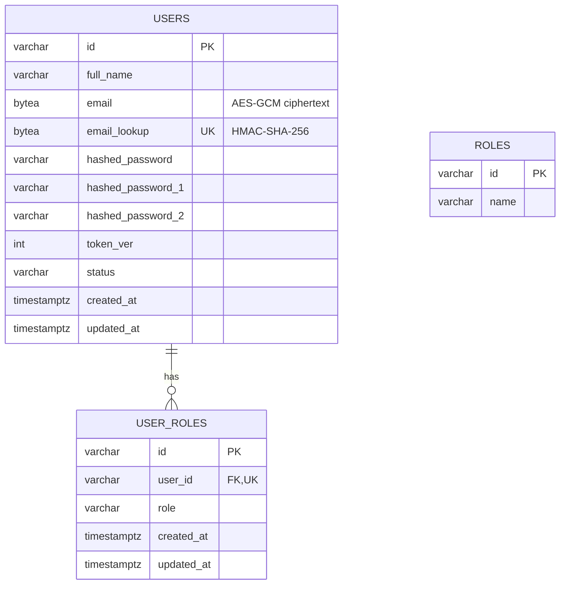
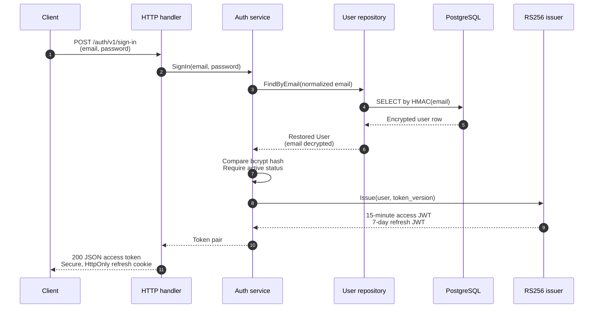
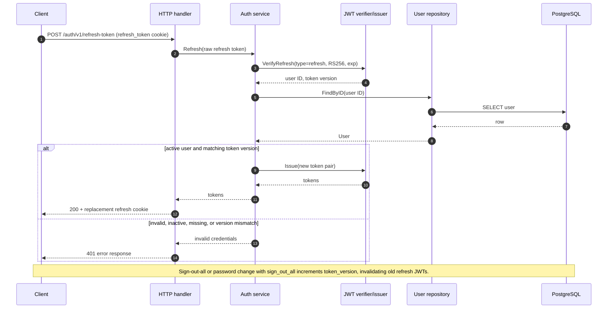
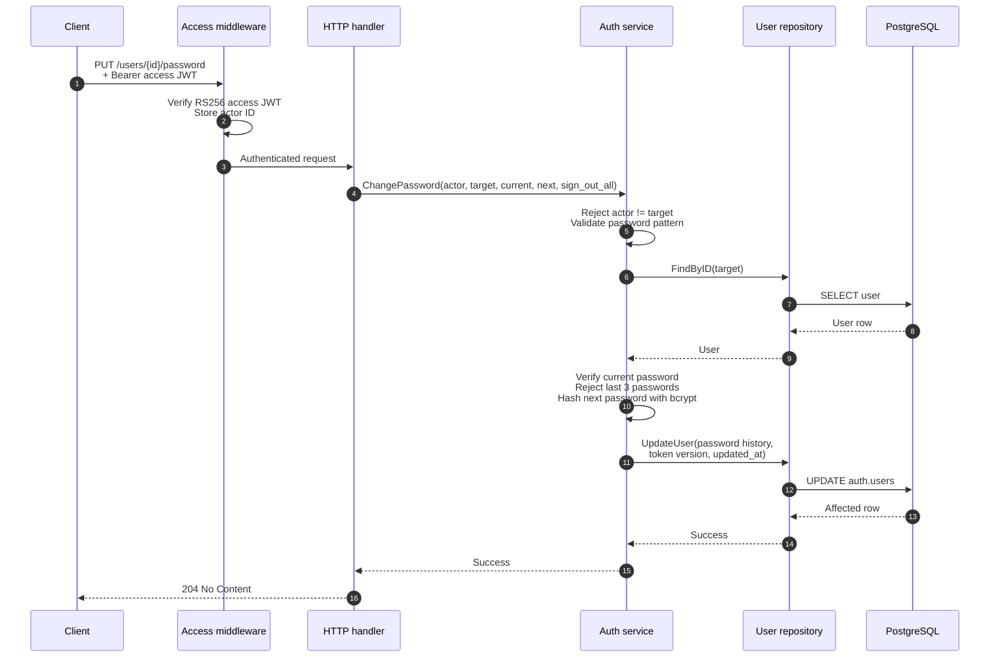

# Auth module feature prompt

Use the following prompt when generating the auth (authentication) module.
- module name: `auth`
- use `oapi-codegen` to generate http handler.
- use `sqlc` to generate `go` code bases on `queries/<table-name>.sql`


Implement a production-oriented Go authentication module in this repository,
following the existing module conventions and the API error contract in
AGENTS.md. The module owns credentials, account lifecycle status, refresh-token
revocation, account lifecycle status, and user roles. Keep the implementation transport
agnostic outside the HTTP adapter.

## Package layout and boundaries

Create the module under `modules/auth` with this structure:

- `domain`: a `User` aggregate with private state and constructors/restorers.
- `app`: use cases plus narrow, consumer-owned `Repository`, `TokenIssuer`, and
  `PasswordHasher` interfaces.
- `adapters/db`: PostgreSQL/sqlc repository, migrations, SQL queries, and email
  cryptography. Do not leak sqlc or pgx models outside this package. Normal
  sign-up creates the user's `user` role in the same transaction.
- `adapters/token`: RS256 JWT issuer/verifier.
- `api/http`: OpenAPI 3.0.3 source, generated strict Echo types/handlers, HTTP
  middleware, docs registration, and error mapping.
- `api/module`: a tiny in-process module API; put the consumer-facing interface
  in `api/module/client`.
- `module.go`: lifecycle composition only: build adapters/application service,
  apply embedded migrations, register HTTP routes, and publish the module
  contract through `common/module/contracts.Contracts`.

Dependency direction is `api/http -> app -> domain`; adapters may depend on app
and domain; domain has no infrastructure dependencies. Do not export the
application service to other modules. Publish only
`api/module/client.Authenticator` with
`AuthenticateAccessToken(raw string) (Identity, error)`, register it in
`Contracts.Auth`, and have consumers depend on that interface.

## Domain and use cases

Model a user with UUID ID, normalized email, full name, current bcrypt hash,
the two immediately previous hashes, positive `token_version`, status, and UTC
creation/update timestamps. The only valid statuses are `active`, `disabled`,
and `deleted`.

Implement these invariants and use cases:

1. Sign up normalizes/lowercases email, validates it as an address, creates an
   active user with token version 1, hashes the password with bcrypt, and
   rejects an existing email.
2. Passwords are 8–32 characters, use only letters, digits, and `@#$*-_`, and
   require at least one lowercase letter, uppercase letter, number, and allowed
   special character. Return a structured `common.Error` with a password field
   detail for sign-up validation failures.
3. Sign in treats unknown email, wrong password, and non-active account
   identically: `invalid_credentials`.
4. Refresh validates a refresh JWT, reloads the user, requires an active user,
   and requires the token's version to equal the stored version before issuing
   a replacement pair.
5. Change password permits only the authenticated user to modify their own
   user ID, verifies the current password, rejects the current password and the
   two prior passwords, keeps the two newest previous hashes, and optionally
   optionally increments `token_version` when `sign_out_all` is true.
6. Update full name and status only when actor ID equals target user ID. (This
   matches the reference module; do not silently turn status into an admin
   operation.)
7. Sign out all devices increments `token_version` and clears the refresh
   cookie. This invalidates existing refresh tokens; access tokens remain valid
   until their short expiry.
8. Bootstrap the first system account through `CreateSuperadmin`, reusing the
   exact sign-up validation, hashing, normalization, encryption, and domain
   construction path. It creates the `superadmin` role atomically with the
   user and succeeds only while `auth.users` is empty. This reference API is
   intentionally always registered and has no setup-secret configuration;
   do not invent a secret header, environment variable, or authentication
   requirement unless the product contract is explicitly being changed.

Use stable app sentinel errors only where the HTTP port maps them explicitly
(`email taken`, `invalid credentials`, `forbidden`, and `not found`). Known
client-safe validation failures must be `common.Error`. Never return or send
an internal database, crypto, JWT, or bcrypt error to a client.

## Security implementation

- Hash passwords with bcrypt.
- Encrypt `users.email` with AES-256-GCM. Store nonce-prefixed randomized
  ciphertext in `email`; do not store plaintext email.
- Store a separate HMAC-SHA-256 of normalized email in `email_lookup` for
  deterministic lookup and uniqueness. Encryption and lookup keys are distinct
  mandatory configuration values.
- Parse a PEM RSA private and public key at module initialization. Sign and
  verify only `RS256` JWTs.
- Issue an access token lasting 15 minutes and refresh token lasting 7 days.
  Include `user_id`, `token_version`, `plan` (currently `free`), token `type`
  (`access` or `refresh`), `iat`, and `exp` claims. Reject the wrong type,
  invalid UUID, non-positive token version, expired token, or unexpected
  signing algorithm.
- Return only access token, expiry seconds, and `Bearer` token type in JSON.
  Set the refresh token as `refresh_token`, path `/auth`, 7-day max age,
  `HttpOnly`, `Secure`, and `SameSite=Strict`. Refresh is read only from that
  cookie. For protected routes, accept an access JWT from `Authorization:
  Bearer <token>` and, as a fallback, `access_token` cookie.

## Database design

Create schema `auth` and apply the following logical schema. Use UUID strings
(`VARCHAR(36)`) to remain consistent with the existing repository.

### Tables

| Table | Columns | Constraints and purpose |
| --- | --- | --- |
| `auth.users` | `id VARCHAR(36)`, `full_name VARCHAR(255) NOT NULL DEFAULT ''`, `email BYTEA`, `email_lookup BYTEA`, `email_to VARCHAR(255) NULL`, `hashed_password VARCHAR(255)`, `hashed_password_1 VARCHAR(255) NOT NULL DEFAULT ''`, `hashed_password_2 VARCHAR(255) NOT NULL DEFAULT ''`, `token_ver INT`, `created_at TIMESTAMPTZ`, `updated_at TIMESTAMPTZ`, `status VARCHAR(16)` | PK `id`; `email`, `email_lookup`, password, token version, and timestamps are NOT NULL. `token_ver > 0`. Unique `email_lookup` and `email_to`. Status check: `active`, `disabled`, `deleted`. `email_to` is a reserved legacy/transition field and is not used by current auth flows. |
| `auth.roles` | `id VARCHAR(36)`, `name VARCHAR(255)` | PK `id`; name NOT NULL with default `guest`. Role catalog. |
| `auth.user_roles` | `id VARCHAR(36)`, `user_id VARCHAR(36)`, `role VARCHAR(16)`, `created_at TIMESTAMPTZ`, `updated_at TIMESTAMPTZ` | PK `id`; `user_id` is unique and FK to `users`; role check: `superadmin`, `admin`, `moderator`, `user`, `vendor`. A partial unique index permits at most one `superadmin` role. Product scope is intentionally not part of this table. |

Generate sqlc methods for `CreateUser`, `CreateUserRole`,
`LockInitialAccountCreation`, `HasAnyUser`, `GetUserByEmail`, `GetUserByID`,
and `UpdateUser`. Create user and role in one transaction. Serialize initial
account creation with `pg_advisory_xact_lock`, reject `CreateSuperadmin` when
any user exists, and retain the partial unique superadmin-role index as a
database backstop. The repository encrypts/decrypts email and maps PostgreSQL
unique violation `23505` to the app-level email-taken error, `pgx.ErrNoRows`
to not found, and an update affecting zero rows to not found.



## HTTP API specification

Serve and document the API at base URL `/auth/v1`. Put every request and
response model below in `api/http/openapi.yaml`, make every public error field
required, run `oapi-codegen`, and implement generated strict handlers. Include
the sign-out route in OpenAPI as well as code; do not leave generated routes
and the spec out of sync.

All errors use this exact JSON shape, including unknown/global HTTP errors:

```json
{"message":"client-safe message","slug":"stable_slug","details":[]}
```

`details` is always present. Each item has required `entity_type`, `entity_id`,
`error_slug`, and `message`. Use the generated error response types at the
handler and authentication-middleware boundary. Serialize only public fields;
never expose `InternalError` or `err.Error()`.

| Operation | Method and path | Auth | Request | Success | Errors |
| --- | --- | --- | --- | --- | --- |
| Bootstrap superadmin | `POST /internal/superadmin` | none; only while `auth.users` is empty | same as sign-up | `201 {id: uuid}` | 400 invalid/missing body; 409 `account_exists` once any account exists, or `email_taken` |
| Sign up | `POST /sign-up` | none | `{email, password, full_name?}` | `201 {id: uuid}` | 400 invalid/missing body; 409 `email_taken` |
| Sign in | `POST /sign-in` | none | `{email, password}` | `200 {access_token, expires_in, token_type}` plus refresh cookie | 400 missing body; 401 `invalid_credentials` |
| Refresh | `POST /refresh-token` | `refresh_token` cookie | no body | `200` token response plus rotated refresh cookie | 401 `invalid_credentials` |
| Sign out all devices | `POST /sign-out-all-devices` | access JWT | no body | 204 plus expired refresh cookie | 401 `authentication_required` |
| Change password | `PUT /users/{id}/password` | access JWT | `{password, new_password, sign_out_all?}` | 204 | 400 validation; 401 invalid credentials; 403 other user; 404 user absent |
| Update full name | `PATCH /users/{id}/full-name` | access JWT | `{full_name}` | 204 | 400 validation; 401 authentication required; 403 other user; 404 user absent |
| Update status | `PATCH /users/{id}/status` | access JWT | `{status: active|disabled|deleted}` | 204 | 400 validation; 401 authentication required; 403 other user; 404 user absent |

## Required sequence diagrams

Add these diagrams to the module documentation or design notes.

### Sign in



### Refresh and revocation



### Protected password change



## Verification

Write domain tests for normalization, status, password history, and token
version changes; application tests with fakes for all use cases; adapter tests
for email encryption and JWT algorithm/type/expiry checks; handler tests for
the exact error JSON contract. At minimum test structured `common.Error`, a
safe fallback for an unknown error, `details: []`, cookie flags, duplicate
email mapping, refresh-token version revocation, and actor/target authorization.
Run formatting, OpenAPI generation, and the relevant Go test suite. Report
the generated files and commands run.


## Source notes

This prompt reflects `dealership/modules/auth` as the reference implementation.
Keep the password requirements, generated OpenAPI routes (including sign-out
and bootstrap superadmin), and the module's no-secret bootstrap policy aligned
with that implementation unless a deliberate product change says otherwise.

## Verification update (2026-08-26)

The auth module was reviewed against this contract. The documented
sign-out-all-devices operation is implemented across the domain, application,
HTTP, and generated OpenAPI layers, including refresh-token version revocation
and refresh-cookie expiry. Redundant Echo-context middleware remains removed
from routes that do not set cookies.
