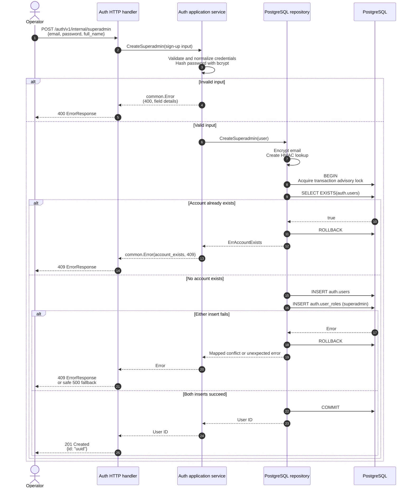

# Superadmin bootstrap prompt

Use this prompt to implement the initial-superadmin capability consistently
with `dealership/modules/auth`.

Implement the auth module's first-account bootstrap endpoint. Follow the
existing auth module conventions and the API error contract in AGENTS.md.
This is an initial setup flow, not an account-promotion API.

## Behaviour

- Expose `POST /auth/v1/internal/superadmin`. It is always registered and has
  no setup-secret header or environment variable in the reference contract.
  Do not add secret-based authorization unless that is an explicit product
  change with its own configuration and migration plan.
- Reuse the normal sign-up path's email normalization and validation,
  password-pattern validation, bcrypt hashing, AES-256-GCM email encryption,
  HMAC-SHA-256 email lookup, UUID creation, timestamps, and `active` status.
- Persist the user and its `superadmin` role in the same PostgreSQL
  transaction. A failure to create either rolls back both.
- Permit this operation only while `auth.users` is empty. If any auth user
  already exists, return the stable conflict `account_exists`; do not promote
  an existing user and do not create another account.
- Protect the empty-table check from concurrent requests using the same
  transaction-scoped advisory lock used by account creation. Retain a partial
  unique index on `auth.user_roles(role) WHERE role = 'superadmin'` as a
  database-level backstop. `user_id` is unique in `auth.user_roles`.
- Normal sign-up creates the `user` role; bootstrap creation creates the
  `superadmin` role. Product authorization remains outside auth.

## Request sequence



## Layering

- Add `CreateSuperadmin` to the auth application service and a minimal
  repository port. The app use case is transport-agnostic and reuses the
  normal user-construction/validation flow.
- Put SQL, transaction handling, advisory locking, duplicate mapping, and
  email cryptography in `adapters/db`; do not expose sqlc or pgx types outside
  that adapter.
- Add the operation to `api/http/openapi.yaml`, regenerate strict Echo types
  with `oapi-codegen`, and implement the generated strict handler. It has no
  authentication middleware in the reference route registration.
- Do not publish bootstrap creation from `api/module`, `app`, `domain`, or an
  adapter. The only auth cross-module capability remains
  `api/module/client.Authenticator`.

## HTTP contract

Request:

```json
{"email":"owner@example.com","password":"OwnerPass1@","full_name":"System Owner"}
```

Responses:

- `201 Created`: `{ "id": "uuid" }`
- `400 Bad Request`: invalid or missing body; known validation failures use
  structured field details.
- `409 Conflict`: `account_exists` if any account already exists; `email_taken`
  for an email uniqueness conflict that occurs first.
- Unexpected errors are logged and emitted through the global safe fallback.

Every error response, including the fallback, is exactly:

```json
{"message":"client-safe message","slug":"stable_slug","details":[]}
```

Use generated OpenAPI error response models at the strict-handler boundary.
Return `common.Error` for known client-safe validation/conflict conditions;
never serialize `common.Error`, `InternalError`, `err.Error()`, SQL errors,
encrypted email, password hashes, or tokens directly.

## Required tests

- Application tests: successful normalized user creation with superadmin role;
  invalid email/password field details; one success and one `account_exists`
  result for concurrent attempts.
- Repository/integration tests: user and role are atomic; empty-table check is
  serialized; the partial unique superadmin index protects the invariant.
- HTTP tests: success, missing/invalid request, structured validation error,
  `account_exists` conflict with `details: []`, and safe fallback for an
  unexpected error. Confirm no internal error text is returned.

Regenerate generated code, format Go files, and run the relevant Go tests.

## Verification update (2026-08-26)

The bootstrap flow was verified together with the auth module. It remains an
always-registered, unauthenticated first-account operation with no setup
secret, shared sign-up validation, atomic user/role creation, advisory-lock
serialization, and safe public error mapping. The OpenAPI-generated handler
and tests remain aligned with this contract; no bootstrap-specific unused
public API or authorization path was found.
